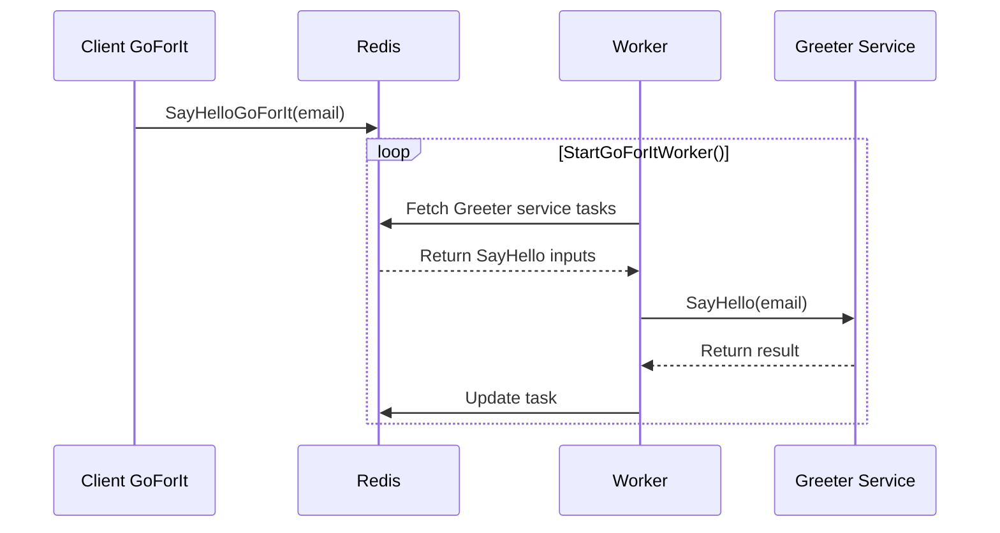

## Initial design

Go For It goal is to be a super easy opt-in - opt-out plugin allowing to do simple async calls for an go gRPC services.
It should do two things:
- Create go-forit client and wanted async rpc methods
- Create go-forit main worker loop


It does not require any platform like temporal nor changes to existing service. Easy to try, easy to quit, just go for 


## Example

Greeter service is used to send an email to new users on account creation:
```json
service Greeter {
  rpc SayHello (HelloRequest) returns (google.protobuf.Empty) {}
}
```

It does not mater when nor after how many retries the email is sent. I would like my webservice to notify the need to send the email and process something else

Let's use go-forit:
```json
service Greeter {
  rpc SayHello (HelloRequest) returns (google.protobuf.Empty) {
    option (goforit.v1) = {
        foo: 'bar'
    }
  }
}
```

This would generate functions and client to use:    
```go
c, err := greeter.NewGoForItClient()
```

```go
c.SayHelloGoForIt(email)
```

Now the GoForIt worker can either be running on a dedicated service or directly on the gRPC service

```go
func main() {
    // Things

    greeter.StartGoForItWorker()

    // Other things
}
```

